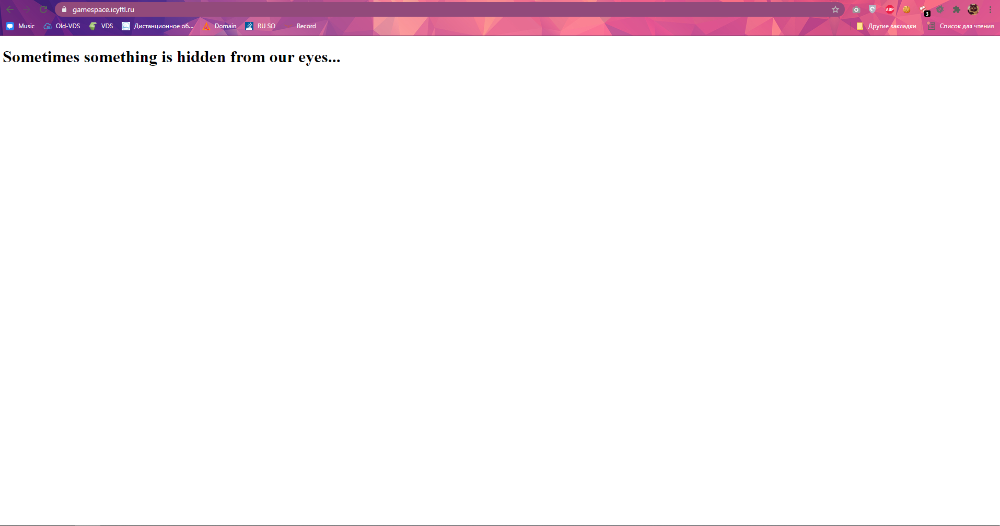
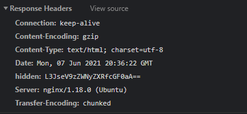
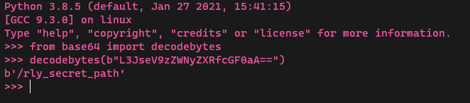
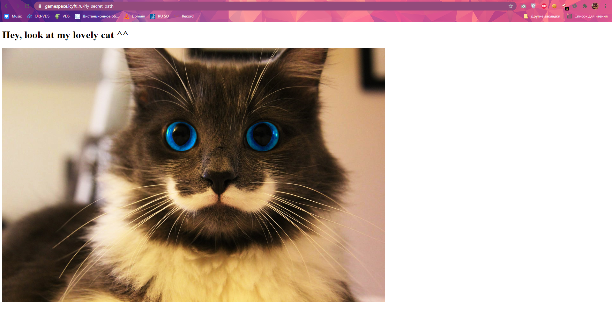
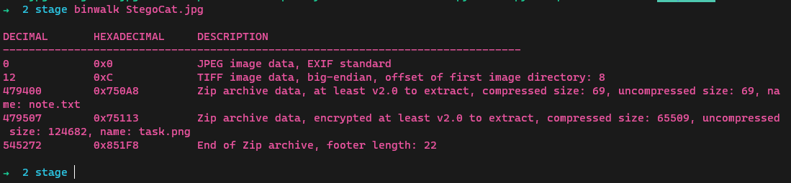
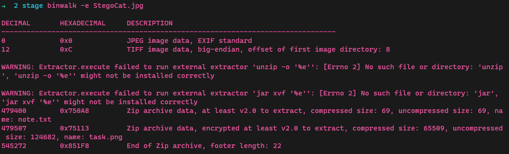
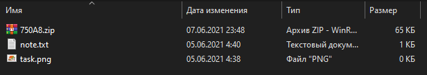
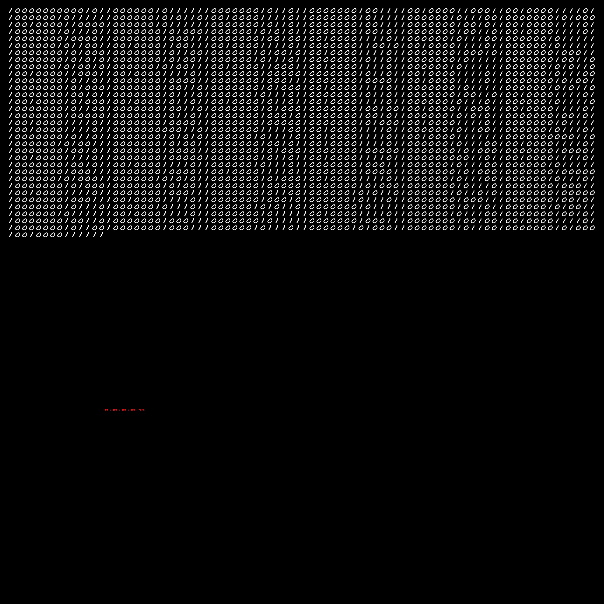

# Light CTF 2021 II quarter

## Stage I
Все началось с сообщения:  

> У меня появилось чуть-чуть свободного времени и если ты умный в плане стфов или в целом понимании работы вещей из грубо говоря IT, то можешь повеселиться,
ведь именно для тебя я придумал мини-стф с приколами.  
>
> Возрадуйся, @frovie  
>
> Будет:  
> • Стеганография  
> • Криптография  
> • Веб  
> • Crack  

> В ЦЕЛОМ, это отчасти рассчитано на пройденный материал в универе за 2 курса. (Прогинж точно)  

> Можно задать мне 1 вопрос, но только один.  
И то вообще вопросы обычно незя, но в силу того, что я все поднял и придумал с 0 всего за 2.5 часа, то 1 вопрос допустим.  

>Желаю удачи, вот энтрипоинт:  
https://gamespace.icyftl.ru/  

> (Время до 09.06.2021 02:45)  

Итак, у нас есть ссылка `https://gamespace.icyftl.ru/`. Давайте перейдем по ней.

В 7 из 10 случаев, когда мы видим похожий текст и при этом таск "дешевый" (или начальный) -- это отсылка либо к кукам, либо к response headers (взирая на мой небольшой опыт CTF соревнований).  
Смотрим headers и видим следующее:

Видим ключ `hidden` и на что эта строка может быть похожа? Правильно! На `base64`. Декодим.

Получаем строку `/rly_secret_path`. Напоминает путь, не правда ли? Перейдем по нему:
https://gamespace.icyftl.ru/rly_secret_path

Опять же, в большинстве случаев первые действия при получении похожего таска есть проверка картинки, но это уже плавный переход на Stage 2.

## Stage II

Скачиваем картинку. Вообще, лично я сразу машинально проверяю [EXIF метаданные](https://ru.wikipedia.org/wiki/EXIF), после этого
идет проверка [StegTool]("https://github.com/aallott/StegTool")'ом и если ничего не найдено, то только после этого я начинаю
копаться в файле еще более глубже. В дело вступает [binwalk]("https://tools.kali.org/forensics/binwalk").  
Пройдемся по файлу с его помощью:

И вуаля! Видим, что в файл картинки также засунули `zip` архив. Кто же это сделал...

Достаем архив через тот же `binwalk` и перемещаемся на Stage 3:

## Stage III

Видим 3 файла (на самом деле `note.txt` и `task.png` лежат в архиве и `binwalk` просто сразу достал их оттуда, но на всяк случай и сам архив тоже).

Откроем `note.txt` и увидим следующее:

> All symbols in this string can be used in password like: 123456789 XD

Открываем архив и видим запароленную картинку. Намек понят? :D

Словарь есть, брутим пароль.

Пароль был 6-ти символьный: `9X2:45`

Используя его, достаем картинку:

Итак, мы имеем бинарный код и красную пометку, которая является намеком на [XOR]("https://ru.wikipedia.org/wiki/%D0%98%D1%81%D0%BA%D0%BB%D1%8E%D1%87%D0%B0%D1%8E%D1%89%D0%B5%D0%B5_%C2%AB%D0%B8%D0%BB%D0%B8%C2%BB") 9245.

Вообще, это является отсылкой на один из самых моих любимых тасков - [Мнистерство статистики]("https://github.com/teamteamdev/ugractf-2020-quals/tree/master/tasks/mnist") и идеально было бы поднять [MNIST]("https://ru.wikipedia.org/wiki/MNIST_(%D0%B1%D0%B0%D0%B7%D0%B0_%D0%B4%D0%B0%D0%BD%D0%BD%D1%8B%D1%85)"), но тут решайте сами. Можно было бы и вручную переписать - цифр не особо много.

Получив цифры, встает вопрос че с ними делать. Перво наперво стоит попробовать перевести их в dec (10-тичная СС).
Переведя, мы получим вполне приемлимые значения, но не для таблицы ASCII, хотя она первая может придти в голову.  
Вспоминаем про `XOR` 9245, ксорим и получаем уже готовые значения для таблицы ASCII. Перевести уже есть дело техники.

### Итоговый ответ:  
> Итак, ты все-таки решил мой стф. Я тебя поздравляю, ты, на самом деле выиграл 500 рублей, напиши мне в ЛС фразу "Люди с ростом меньше среднего обычно проигрывают в силовой борьбе"

Спасибо за то что принял участие.
